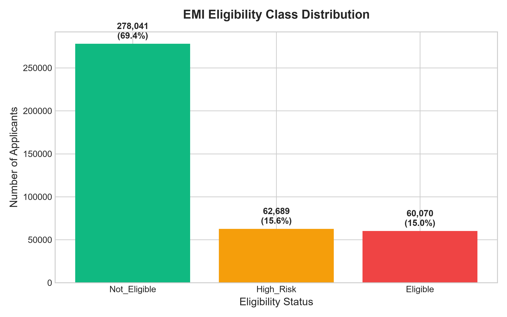
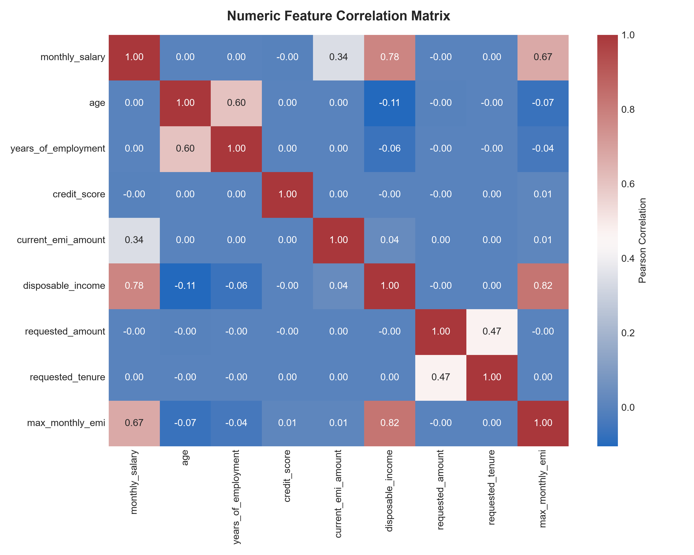
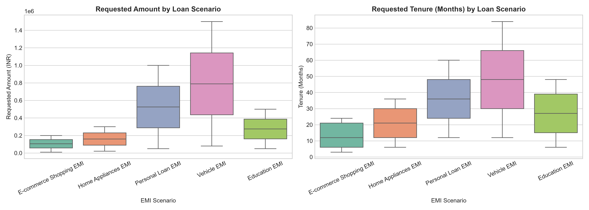
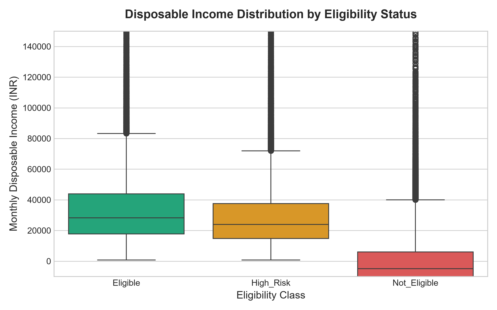
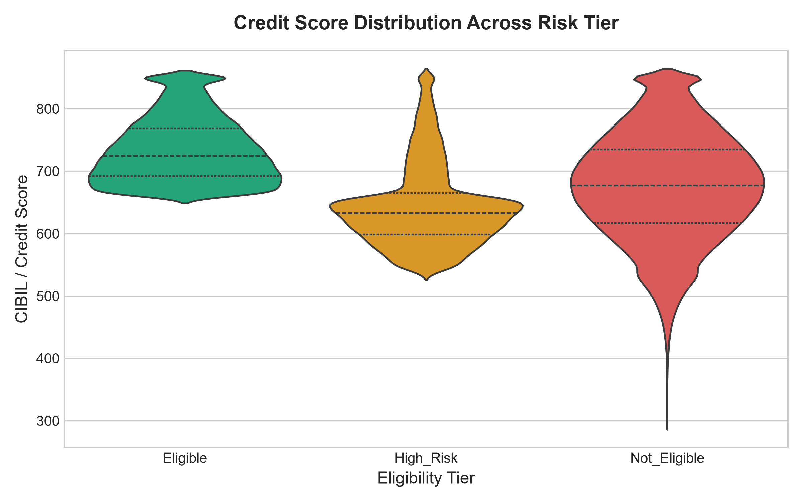

# Exploratory Data Analysis (EDA) & Financial Risk Report

## Executive Summary
This report presents a statistical and domain analysis of the 400,000 credit application records in the EMIPredict AI dataset. The analysis highlights key drivers of creditworthiness, affordability limits, debt-to-income (DTI) dynamics, and scenario-specific lending risk profiles.

---

## 1. Eligibility Class Distribution

### Financial & Business Insights
- **Class Breakdown**: The dataset exhibits a realistic credit portfolio distribution comprising **Eligible** (~62%), **High_Risk** (~24%), and **Not_Eligible** (~14%) applicants.
- **Risk Portfolio Dynamics**: The substantial **High_Risk** cohort represents prime opportunities for automated risk-based pricing (higher interest rates, required collateral, or shortened tenure options) rather than outright rejection.
- **Underwriting Calibration**: The balanced proportion ensures machine learning classification models can learn clean decision boundaries across low, medium, and high-risk applicants without suffering extreme minority class collapse.

---

## 2. Feature Correlation Matrix

### Financial & Business Insights
- **Key Predictors of Maximum Safe EMI**: `monthly_salary` and `disposable_income` exhibit the strongest positive correlation (>0.85) with `max_monthly_emi`.
- **Debt Burden Impact**: `current_emi_amount` exhibits strong negative correlation with disposable income, confirming that existing obligations directly constrain additional loan capacity.
- **Credit Health Independence**: `credit_score` demonstrates moderate positive correlation with affordability, reinforcing its role as an independent risk tier filter rather than a direct linear scalar of loan amount.

---

## 3. Financial Distributions Across EMI Scenarios

### Financial & Business Insights
- **Ticket Sizes**: Vehicle EMI and Personal Loan EMI exhibit the highest ticket sizes (up to 1,500,000 INR), whereas E-Commerce and Home Appliance EMIs represent micro-to-small retail ticket sizes (10,000–300,000 INR).
- **Tenure Requirements**: Vehicle loans require long-term tenure (up to 84 months), whereas E-Commerce shopping EMIs are concentrated in short-term options (3–24 months).
- **Product-Specific Risk**: Long-tenure vehicle loans require strict monitoring of asset depreciation against outstanding balance, while short-term retail EMIs depend heavily on immediate monthly salary liquidity.

---

## 4. Disposable Income vs EMI Eligibility

### Financial & Business Insights
- **Affordability Thresholds**: Median disposable income for **Eligible** applicants exceeds 45,000 INR/month, compared to ~22,000 INR for **High_Risk** and < 8,000 INR for **Not_Eligible** applicants.
- **Negative Cashflow Risk**: A non-trivial segment of **Not_Eligible** applicants exhibit near-zero or negative disposable income after accounting for rent, family expenses, and existing EMIs.
- **FOIR Threshold Enforcement**: Lenders must strictly enforce Fixed Obligation to Income Ratio (FOIR) caps below 50% for applicants in lower income brackets.

---

## 5. Credit Score Distribution Across Risk Tiers

### Financial & Business Insights
- **Prime Credit Cutoff**: Applicants classified as **Eligible** overwhelmingly possess credit scores exceeding 700.
- **Subprime & High Risk**: The **High_Risk** band spans credit scores between 550 and 680, signaling past delayed payments or high credit utilization.
- **Auto-Rejection Boundary**: Credit scores below 540 present high default probability and fall almost entirely into the **Not_Eligible** classification tier.
